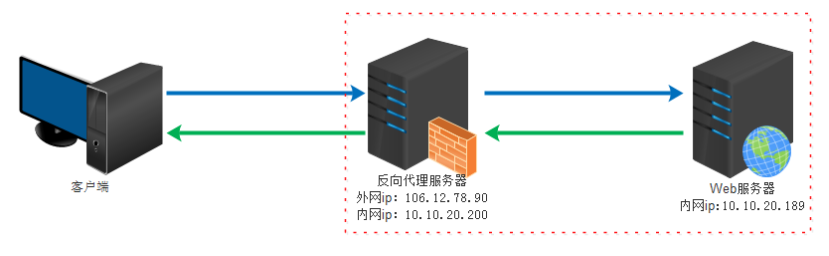

# 常规笔记


## 一、socket  tcp/ip


### 0、什么是TCP/IP，UDP

   tcp/ip是传输控制协议/网间协议，是一种标准协议，它是广域网设计的；UDP是与TCP对应的，是属于tcp/ip协议的一种。

TCP/IP协议族包括运输层、网络层、链路层


### 1、socket是什么？

  socket是应用层与TCP/IP协议族通信的中间软件抽象层，它是一组接口。在设计模式中属于**门面模式**，

  socket起源于Unix中，而unix/linux基本哲学是：“一切皆是文件”，都可以用Open->wiret/read->close;我的理解 socket就是该模式的实现；

​     

### socket中TCP的三次握手建立连接详解

我们知道tcp建立连接要进行“三次握手”，即交换三个分组。大致流程如下：

- 客户端向服务器发送一个SYN J
- 服务器向客户端响应一个SYN K，并对SYN J进行确认ACK J+1
- 客户端再想服务器发一个确认ACK K+1


### 2、socket为什么要三次握手

 在《计算机网络中》是这样描述的：“三次握手的目的”：“为了防止已失效的连接请求报文段突然又传到了服务端”；

**例子**：client发出的第一个连接请求报文段并没有丢失，而是在某个网络结点长时间的滞留了，以致延误到连接释放以后的某个时间才到达server。本来这是一个早已失效的报文段。但server收到此失效的连接请求报文段后，就误认为是client再次发出的一个新的连接请求。于是就向client发出确认报文段，同意建立连接。假设不采用“三次握手”，那么只要server发出确认，新的连接就建立了。由于现在client并没有发出建立连接的请求，因此不会理睬server的确认，也不会向server发送数据。但server却以为新的运输连接已经建立，并一直等待client发来数据。这样，server的很多资源就白白浪费掉了。采用“三次握手”的办法可以防止上述现象发生。例如刚才那种情况，client不会向server的确认发出确认。server由于收不到确认，就知道client并没有要求建立连接。


### 3、本地通信有哪些

   1、消息传递；

   2、同步（互斥量、条件量、读写锁、文件和记录锁，信号量）

  3、共享内存

   4、远程过程调用（RPC）


### 4、网络中进程之间是如何通信

 唯一标识PID是：IP地址+协议+端口可以标识网络的进程，  

 使用TCP/IP协议的应用程序通常采用应用编程接口：socket来实现网络之间的通信；


## 二、Mqtt基本常识


### 1、简介

​     MQtt是IBM开发的即使通信协议，是一种轻量级的消息发布和主题订阅的协议；专门为网络受限制的设备或者低宽度高延时和不可靠的网络二设计的。由于以上特点是智能家居的首选协议。

### 2、特点

- 由于是发布/消息协议可以实现一对多的消息发布。

- 轻量级，网络开销小。

- 对负载内容会有屏蔽的消息传输。

- 有三中消息发送质量（Qos）:

  qos=0 “至多一次”，这一级别会发生消息丢失或重复，消息发布依赖于TCP/IP网络

  qos=1：“至少一次”，确保消息到达，但消息重复可能会发生

  qos=2：“只有一次”，确保消息到达一次

- 通知机制，异常中断时会通知双方

  

  **cleanSession** 具体含义

  true 时 ：非持久化连接，客户端再次连接时，将不在关心之前所有的订阅关系。

  false时：持久化连接，客户端再次连接时，还需要处理之前的离线消息，而之前的订阅关系也会持续生效。

  


### 3、主题订阅规则

层级分类
主题层级分隔符: /
多层通配符: #
单层通配符: +


“/”: 使用来分割主题的每一层

“#”：订阅的通配符

“+”：订阅的单通配符，订阅主题: /test/child/+  我们将收到这些主题发送来的消息:注意:接收不到 /test/child 主题发送的消息。

​     

### 4、原理

Mqtt 分为 发布者、代理节点、消息订阅；其中发布者和消息订阅者都是客户端，代理节点是服务端，发布者把消息发送给代理节点，代理节点把消息推送给消息订阅者。其中消息有 主题（topic）,消息内容（payload），qos、消息长度（length）等。

### 5、安全处理

mqtt内部有写多的认证规则比如：（jwt、mysql、redis、mysql）等验证规则；


## 三、Nginx

###     1、Nginx是什么？

​         Nginx是俄罗斯人Igor Sysoev开发的一个轻量级的web服务器；它不仅是一个Http和反向代理的服务器同事也是一个IMAP/POP3/SMTP代理服务器；

###    2、Nginx特点

​       占用资源少，并发能力强。

### 3，为什么要用Nginx？

跨平台、配置简单、方向代理、高并发连接：处理2-3万并发连接数，官方监测能支持5万并发，内存消耗小：开启10个nginx才占150M内存 ，nginx处理静态文件好，耗费内存少，

而且Nginx内置的健康检查功能：如果有一个服务器宕机，会做一个健康检查，再发送的请求就不会发送到宕机的服务器了。重新将请求提交到其他的节点上。

使用Nginx的话还能：

节省宽带：支持GZIP压缩，可以添加浏览器本地缓存
稳定性高：宕机的概率非常小
接收用户请求是异步的

### 4，为什么Nginx性能这么高？

- 因为他的事件处理机制：异步非阻塞事件处理机制：运用了epoll模型，提供了一个队列，排队解决


### 5，正向代理与反向代理的区别


**正向代理：**

   正向代理,也就是传说中的代理,他的工作原理就像一个跳板；

比如我们国内访问谷歌，直接访问访问不到，我们可以通过一个正向代理服务器，请求发到代理服，代理服务器能够访问谷歌，这样由代理去谷歌取到返回数据，再返回给我们，这样我们就能访问谷歌了


**正向代理的用途：**

　　（1）访问原来无法访问的资源，如google

​    （2） 可以做缓存，加速访问资源

　　（3）对客户端访问授权，上网进行认证

　　（4）代理可以记录用户访问记录（上网行为管理），对外隐藏用户信息

**反向代理**

 反向代理（Reverse Proxy）实际运行方式是指以代理服务器来接受internet上的连接请求，然后将请求转发给内部网络上的服务器，并将从服务器上得到的结果返回给internet上请求连接的客户端，此时代理服务器对外就表现为一个服务器



**反向代理的作用**：

（1）保证内网的安全，阻止web攻击，大型网站，通常将反向代理作为公网访问地址，Web服务器是内网

（2）负载均衡，通过反向代理服务器来优化网站的负载


总结：


    ### 6、Nginx相关命令

 启动nginx：nginx
 停止nginx：nginx -s stop
 重启nginx：nginx -s reload
 使用指定配置文件启动nginx：nginx -c 文件路径
 检查nginx配置文件：nginx -t
 查看nginx版本信息：nginx -v
 查看所有端口占用情况：netstat -antp | grep :
 杀掉全部nginx进程：killall -9 nginx
 注意：systemctl 命令重启，停止nginx会出现错误。

### 7、基本配置优化

 ```shell
#头部配置
user  nginx nginx;    #定义nginx的启动用户，不建议使用root
worker_processes  4;　　#定位为cpu的内核数量，因为我的环境配置是4核，所以就写4。不过这值最多也就是8，8个以上也就没什么意义了，想继续提升性能只能参考下面一项配置
worker_cpu_affinity 0001 0010 0100 1000;　　#此项配置为开启多核CPU，对你先弄提升性能有很大帮助nginx默认是不开启的,1为开启，0为关闭，因此先开启第一个倒过来写，
第一位0001（关闭第四个、关闭第三个、关闭第二个、开启第一个）
第二位0010（关闭第四个、关闭第三个、开启第二个、关闭第一个）
第三位0100（关闭第四个、开启第三个、关闭第二个、关闭第一个）
后面的依次类推，有智商的应该都可以看懂了吧？  那么如果是16核或者8核cpu，就注意为00000001、00000010、00000100，总位数与cpu核数一样。
 
error_log  /data/logs/nginx/error.log crit;　　　　　　#这两项基本不用我说
pid        /usr/local/nginx/nginx.pid;
 
#Specifies the value for maximum file descriptors that can be opened by this process.
worker_rlimit_nofile 65535;　　　　#这个值为nginx的worker进程打开的最大文件数，如果不配置，会读取服务器内核参数（通过ulimit -a查看），如果内核的值设置太低会让nginx报错（too many open
file），但是在此设置后，就会读取自己配置的参数不去读取内核参数
 
events
{
  use epoll;　　　　#客户端线程轮询方法、内核2.6版本以上的建议使用epoll
  worker_connections 65535;　　#设置一个worker可以打开的最大连接数
}
http {
        include       mime.types;
        default_type  application/octet-stream;
 
        #charset  gb2312;
        server_tokens  off;　　　　#为错误页面上的nginx版本信息，建议关闭，提升安全性
 
        server_names_hash_bucket_size 128;
        client_header_buffer_size 32k;
        large_client_header_buffers 4 32k;
        client_max_body_size 8m;
 
        sendfile on;　　　　　　#开启sendfile（）函数，sendfile可以再磁盘和tcp socket之间互相copy数据。
        tcp_nopush     on;　　#告诉nginx在数据包中发送所有头文件，而不是一个一个的发
 
        #keepalive_timeout 15;
        keepalive_timeout 120;
 
        tcp_nodelay on;
 
        proxy_intercept_errors on;
        fastcgi_intercept_errors on;
        fastcgi_connect_timeout 1300;
        fastcgi_send_timeout 1300;
        fastcgi_read_timeout 1300;
        fastcgi_buffer_size 512k;
        fastcgi_buffers 4 512k;
        fastcgi_busy_buffers_size 512k;
        fastcgi_temp_file_write_size 512k;
 
        proxy_connect_timeout      20s;
        proxy_send_timeout         30s;
        proxy_read_timeout         30s;
 
 
 
        gzip on;　　　　　　　　　　　　#gzip是告诉nginx采用gzip后的数据来传输文件，会大量减少我们的发数据的量
        gzip_min_length  1k;
        gzip_buffers     4 16k;
        gzip_http_version 1.0;
        gzip_comp_level 2;
        gzip_types       text/plain application/x-javascript text/css application/xml text/javascript application/x-httpd-php image/jpeg image/gif image/png;
        gzip_vary on;
        gzip_disable msie6;
        #limit_zone  crawler  $binary_remote_addr  10m;
 
log_format  main  '$http_host $remote_addr - $remote_user [$time_local] "$request" '
                  '$status $body_bytes_sent "$http_referer" '
                  '"$http_user_agent" "$http_x_forwarded_for" '
                  '$request_time $upstream_response_time';
 
 #proxy_temp_path和proxy_cache_path指定的路径必须在同一分区,因为它们之间是硬链接的关系
 #proxy_temp_path /var/cache/nginx/proxy_temp_dir;
 #设置Web缓存区名称为cache_one，内存缓存空间大小为200MB，1天没有被访问的内容自动清除，硬盘缓存空间大小为30GB。
 #proxy_cache_path /var/cache/nginx/proxy_cache_dir levels=1:2 keys_zone=cache_one:200m inactive=1d max_size=30g;
 
        include /usr/local/nginx/conf/vhosts/*.conf;
 
        error_page  404   = https://www.niu.com/404/;
        #error_page   500 502 503 504 = http://service.niu.com/alien/;
 
 }
 ```

如果是高并发架构，需要在nginx的服务器上添加如下的内核参数

这些参数追加到/etc/sysctl.conf,然后执行sysctl -p 生效。

\#每个网络接口接收数据包速度比内核处理速度快的时候，允许发送队列数目数据包的最大数
net.core.netdev_max_backlog = 262144

\#调节系统同时发起的tcp连接数
net.core.somaxconn = 262144

\#该参数用于设定系统中最多允许存在多少TCP套接字不被关联到任何一个用户文件句柄上，主要目的为防止Ddos攻击
net.ipv4.tcp_max_orphans = 262144

\#该参数用于记录尚未收到客户端确认信息的连接请求的最大值
net.ipv4.tcp_max_syn_backlog = 262144

\#nginx服务上建议关闭（既为0）
net.ipv4.tcp_timestamps = 0

\#该参数用于设置内核放弃TCP连接之前向客户端发送SYN+ACK包的数量，为了建立对端的连接服务，服务器和客户端需要进行三次握手，第二次握手期间，内核需要发送SYN并附带一个回应前一个SYN的ACK，这个参
数主要影响这个过程，一般赋予值为1，即内核放弃连接之前发送一次SYN＋ACK包。
*net.ipv4.tcp_synack_retries = 1
net.ipv4.tcp_syn_retries = 1*


### 8、proxy_pass和fastcgi_pass区别

对于两种情况下proxy_pass和fastcgi_pass可以互相替代使用，不过两者还是有区别的，从名字我们就可以看出来，fastcgi_pass是用来反向代理fastcgi协议，proxy_pass可以代理包括fastcgi协议在内的其它协议。

例如镜像一个网站，这种情况下就需要proxy_pass：

```shell
location /{
    proxy_pass http://www.baidu.com;
}
```

### 9、Nginx实现高可用集群

####     **1,)Nginx主从备份**

​             Nginx实现主从备份目前主流方案是Keepalived+Nginx实现双机热备。

#####             **Keepalived介绍：**

​            keepalived是一个基于VRRP协议来实现的服务高可用方案，可以利用其来避免IP单点故障，类似的工具还有 heartbeat、corosync、pacemaker;但是它们不会单独出现的，而是与其它负载均衡技术（lvs,haproxy,nginx）一起工作来实现高可用的。

#####             **VRRP协议：**

​              VRRP是*虚拟路由冗余协议*。可以认为它是实现路由器高可用的容错协议，即将N台提供相同功能的路由器组成一个路由组，这个组里面有个一个master和很多个backup，但是在外界看来就是一个，单在超时的时间内没有收到vrrp包时就认为是master挂掉了，这个时候就需要几个人VRRP的优先级来选举一个backup单master，保证路由的高可用。

​         在VRRP协议实现里，虚拟路由器使用 00-00-5E-00-01-XX 作为虚拟MAC地址，XX就是唯一的 VRID （Virtual Router IDentifier），这个地址同一时间只有一个物理路由器占用。在虚拟路由器里面的物理路由器组里面通过多播IP地址 224.0.0.18 来定时发送通告消息。每个Router都有一个 1-255 之间的优先级别，级别最高的（highest priority）将成为主控（master）路由器。通过降低master的优先权可以让处于backup状态的路由器抢占（pro-empt）主路由器的状态，两个backup优先级相同的IP地址较大者为master，接管虚拟IP。

​        

 具体实现原理：

1）Master没挂，则Master占有vip且nginx运行在Master上

2）Master挂了，则backup抢占vip且在backup上运行nginx服务

3）如果master服务器上的nginx服务挂了，则vip资源转移到backup服务器上

4）检测后端服务器的健康状态

Master和Backup两边都开启nginx服务，无论Master还是Backup，当其中的一个keepalived服务停止后，vip都会漂移到keepalived服务还在的节点上


**NGINX和keepalived安装配置**

 它俩的安装配置比较多，还有编写脚本实现互相监控、报警等，所以咱们专门放一课来讲，这一课主要讲解决方案和原理。


####     **2,)Nginx分布式集群**

如果有多台NGINX想实现负载均衡的话，

1、每台nginx都有公网地址，在域名处设置同个域名多个指向，最简单实现轮洵。但故障切负会慢一点。
2、一台公网nginx通过upstream功能，轮洵、ip、url多方式分发到内网多台nginx。但公网的nginx如果down机的话，内网全段。
3、一对公网nginx加三个公网ip，通过keepalive实现高可用，再upstream到内网(就是我们刚刚上一节讲的主从备份)。

一般来说，上面1、2、3种方法基本可以解决，建议用2或3；

如果并发量真的巨大的话，一般就要借助硬件F5等设备做负载均衡，跟DNS、CDN等服务商合作做域名解析转发、缓存配置，这也是目前大多数大厂的架构配置。


### 10、如何用Nginx解决前端跨域问题？

- 使用Nginx转发请求。把跨域的接口写成调本域的接口，然后将这些接口转发到真正的请求地址。

#### location的语法能说出来吗？

注意：~ 代表自己输入的英文字母

| 匹配符 | 匹配规则                     | 优先级 |
| ------ | ---------------------------- | ------ |
| =      | 精确匹配                     | 1      |
| ^~     | 以某个字符串开头             | 2      |
| ~      | 区分大小写的正则匹配         | 3      |
| ~*     | 不区分大小写的正则匹配       | 4      |
| !~     | 区分大小写不匹配的正则       | 5      |
| !~*    | 不区分大小写不匹配的正则     | 6      |
| /      | 通用匹配，任何请求都会匹配到 | 7      |

### 11、限流怎么做的？

- Nginx限流就是限制用户请求速度，防止服务器受不了
- 限流有3种
  1. 正常限制访问频率（正常流量）
  2. 突发限制访问频率（突发流量）
  3. 限制并发连接数

- Nginx的限流都是基于漏桶流算法，底下会说道什么是桶铜流

**实现三种限流算法**

##### 1、正常限制访问频率（正常流量）：

限制一个用户发送的请求，我Nginx多久接收一个请求。

Nginx中使用ngx_http_limit_req_module模块来限制的访问频率，限制的原理实质是基于漏桶算法原理来实现的。在nginx.conf配置文件中可以使用limit_req_zone命令及limit_req命令限制单个IP的请求处理频率。

```sh
	#定义限流维度，一个用户一分钟一个请求进来，多余的全部漏掉
	limit_req_zone $binary_remote_addr zone=one:10m rate=1r/m;

	#绑定限流维度
	server{
		
		location/seckill.html{
			limit_req zone=zone;	
			proxy_pass http://lj_seckill;
		}

	}

```

- 1r/s代表1秒一个请求，1r/m一分钟接收一个请求， 如果Nginx这时还有别人的请求没有处理完，Nginx就会拒绝处理该用户请求。

##### 2、突发限制访问频率（突发流量）：

限制一个用户发送的请求，我Nginx多久接收一个。

上面的配置一定程度可以限制访问频率，但是也存在着一个问题：如果突发流量超出请求被拒绝处理，无法处理活动时候的突发流量，这时候应该如何进一步处理呢？Nginx提供burst参数结合nodelay参数可以解决流量突发的问题，可以设置能处理的超过设置的请求数外能额外处理的请求数。我们可以将之前的例子添加burst参数以及nodelay参数：

```shell
	#定义限流维度，一个用户一分钟一个请求进来，多余的全部漏掉
	limit_req_zone $binary_remote_addr zone=one:10m rate=1r/m;

	#绑定限流维度
	server{
		
		location/seckill.html{
			limit_req zone=zone burst=5 nodelay;
			proxy_pass http://lj_seckill;
		}

	}

```

- 为什么就多了一个 burst=5 nodelay; 呢，多了这个可以代表Nginx对于一个用户的请求会立即处理前五个，多余的就慢慢来落，没有其他用户的请求我就处理你的，有其他的请求的话我Nginx就漏掉不接受你的请求

##### 3、 限制并发连接数

- Nginx中的ngx_http_limit_conn_module模块提供了限制并发连接数的功能，可以使用limit_conn_zone指令以及limit_conn执行进行配置。接下来我们可以通过一个简单的例子来看下：

  ```shell
  	http {
  		limit_conn_zone $binary_remote_addr zone=myip:10m;
  		limit_conn_zone $server_name zone=myServerName:10m;
  	}
  
      server {
          location / {
              limit_conn myip 10;
              limit_conn myServerName 100;
              rewrite / http://www.lijie.net permanent;
          }
      }
  
  ```

  

  上面配置了单个IP同时并发连接数最多只能10个连接，并且设置了整个虚拟服务器同时最大并发数最多只能100个链接。当然，只有当请求的header被服务器处理后，虚拟服务器的连接数才会计数。刚才有提到过Nginx是基于漏桶算法原理实现的，实际上限流一般都是基于漏桶算法和令牌桶算法实现的。接下来我们来看看两个算法的介绍：

### 12、漏桶流算法和令牌桶算法知道

##### 漏桶算法

漏桶算法是网络世界中流量整形或速率限制时经常使用的一种算法，它的主要目的是控制数据注入到网络的速率，平滑网络上的突发流量。漏桶算法提供了一种机制，通过它，突发流量可以被整形以便为网络提供一个稳定的流量。也就是我们刚才所讲的情况。漏桶算法提供的机制实际上就是刚才的案例：突发流量会进入到一个漏桶，漏桶会按照我们定义的速率依次处理请求，如果水流过大也就是突发流量过大就会直接溢出，则多余的请求会被拒绝。所以漏桶算法能控制数据的传输速率。


##### 令牌桶算法

令牌桶算法是网络流量整形和速率限制中最常使用的一种算法。典型情况下，令牌桶算法用来控制发送到网络上的数据的数目，并允许突发数据的发送。Google开源项目Guava中的RateLimiter使用的就是令牌桶控制算法。令牌桶算法的机制如下：存在一个大小固定的令牌桶，会以恒定的速率源源不断产生令牌。如果令牌消耗速率小于生产令牌的速度，令牌就会一直产生直至装满整个令牌桶。


### 13、为什么要做动静分离？

- Nginx是当下最热的Web容器，网站优化的重要点在于静态化网站，网站静态化的关键点则是是动静分离，动静分离是让动态网站里的动态网页根据一定规则把不变的资源和经常变的资源区分开来，动静资源做好了拆分以后，我们则根据静态资源的特点将其做缓存操作。
- 让静态的资源只走静态资源服务器，动态的走动态的服务器
- Nginx的静态处理能力很强，但是动态处理能力不足，因此，在企业中常用动静分离技术。
- 对于静态资源比如图片，js，css等文件，我们则在反向代理服务器nginx中进行缓存。这样浏览器在请求一个静态资源时，代理服务器nginx就可以直接处理，无需将请求转发给后端服务器tomcat。
  若用户请求的动态文件，比如servlet,jsp则转发给Tomcat服务器处理，从而实现动静分离。这也是反向代理服务器的一个重要的作用。

### 14、Nginx怎么做的动静分离？

- 只需要指定路径对应的目录。location/可以使用正则表达式匹配。并指定对应的硬盘中的目录。如下：（操作都是在Linux上）

```shell
		location /image/ {
            root   /usr/local/static/;
            autoindex on;
        }

```

创建目录

```shell
mkdir /usr/local/static/image
```

进入目录

```shell
cd  /usr/local/static/image
```

放一张照片上去#

```shell
1.jpg
```

重启 nginx

```shell

```

1. 打开浏览器 输入 server_name/image/1.jpg 就可以访问该静态图片了


### 15、Nginx负载均衡的算法怎么实现的?策略有哪些?

- 为了避免服务器崩溃，大家会通过负载均衡的方式来分担服务器压力。将对台服务器组成一个集群，当用户访问时，先访问到一个转发服务器，再由转发服务器将访问分发到压力更小的服务器。
- Nginx负载均衡实现的策略有以下五种：

####    1 轮询(默认)

- 每个请求按时间顺序逐一分配到不同的后端服务器，如果后端某个服务器宕机，能自动剔除故障系统。

  ```powershell
  upstream backserver { 
   server 192.168.0.12; 
   server 192.168.0.13; 
  } 
  ```


#### 2 权重 weight

- weight的值越大分配
- 到的访问概率越高，主要用于后端每台服务器性能不均衡的情况下。其次是为在主从的情况下设置不同的权值，达到合理有效的地利用主机资源。

```shell
upstream backserver { 
 server 192.168.0.12 weight=2; 
 server 192.168.0.13 weight=8; 
} 
```

#### 3 ip_hash( IP绑定)

- 每个请求按访问IP的哈希结果分配，使来自同一个IP的访客固定访问一台后端服务器，`并且可以有效解决动态网页存在的session共享问题`

```powershell
upstream backserver { 
 ip_hash; 
 server 192.168.0.12:88; 
 server 192.168.0.13:80; 
} 
```

#### 4 fair(第三方插件)

- 必须安装upstream_fair模块。

- 对比 weight、ip_hash更加智能的负载均衡算法，fair算法可以根据页面大小和加载时间长短智能地进行负载均衡，响应时间短的优先分配。

  ```powershell
  upstream backserver { 
   server server1; 
   server server2; 
   fair; 
  } 
  
  ```

  

#### 5、url_hash(第三方插件)

- 必须安装Nginx的hash软件包

- 按访问url的hash结果来分配请求，使每个url定向到同一个后端服务器，可以进一步提高后端缓存服务器的效率。

  ```shell
  upstream backserver { 
   server squid1:3128; 
   server squid2:3128; 
   hash $request_uri; 
   hash_method crc32; 
  } 
  ```

  文档参考：https://blog.csdn.net/weixin_43122090/article/details/105461971


